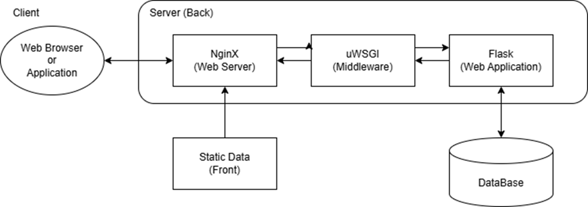

# DB_Project
2024-2학기 데이터베이스 프로젝트 레포지토리

# 가상환경 설정
- 가상환경 생성
```
python -m venv db_env
```
- 가상환경 활성화
```
db_env/Scripts/activate
```
- 가상환경 비활성화
```
deactivate
```
- venv 명령어가 먹히지 않을 경우 powershell을 관리자 권한으로 들어가서 `Set-ExecutionPolicy RemoteSigned` 명령어 실행하기
- 가상환경에 패키지를 설치하면 `pip freeze > requirements.txt`로 패키지 목록 업데이트 바랍니다!

# 아키텍쳐

**uWSGI를 사용하려면 우분투 환경이 필요하므로 윈도웅에서 사용할 수 있는 gunicorn으로 middleware를 구성하는 것으로 변경한다.**